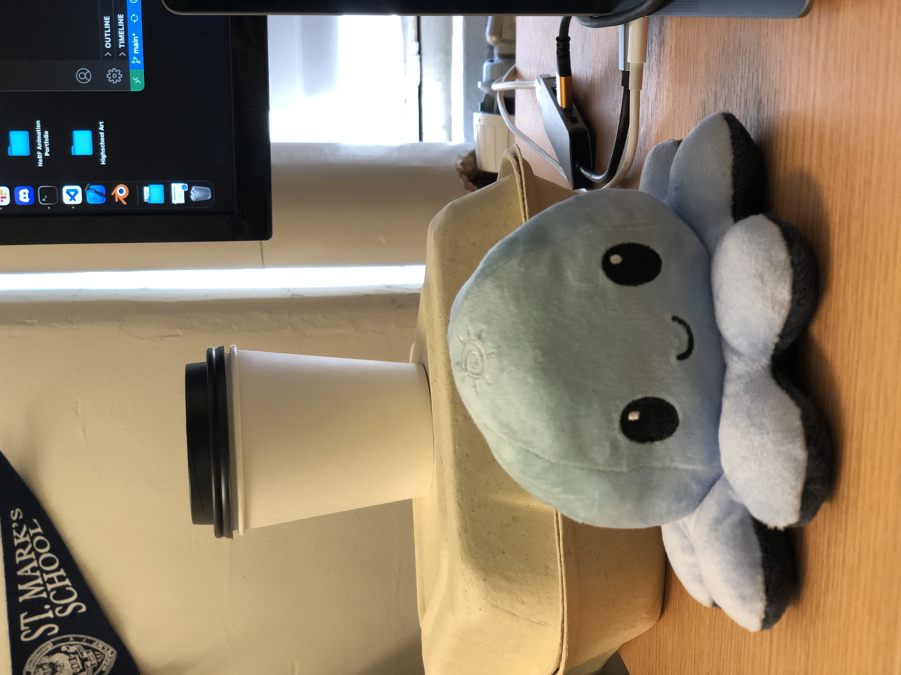
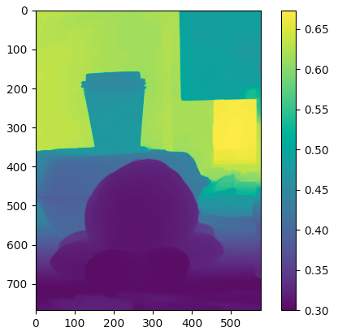

# Depth-Capture-System

Helen Huang's contribution to the 3D Reconstruction final project code for CS1430 Computer Vision.

The codebase includes an implemented iOS app that captures RGB images, depth data, and camera intrinsics of a scene. The data is then used to create and visualize a 3D voxel model of the scene. Implemented in Swift and Python. 

## Demonstration
Depth capture app view:

Captured view's color image and depth map:

Resulting 3D voxel model:

